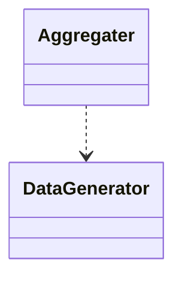
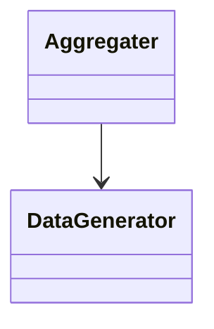

title: classdiagram
====================================
date: 2024-07-10 08:45:10
tags: []
category: []
====================================

## 依存(Dependency)
__依存__は、あるクラスが他のクラスを利用しているが、そのクラスのインスタンスを属性として保持していない場合に用いられます。
今回の例では、クラスBはクラスAの機能を利用していますが、クラスAのインスタンスを属性として保持しているわけではありません。



コード例
```cpp
class DataGenerator {
public:
    int[] generate_data() {
        return [1, 2, 3, 4, 5]
    }
}

class Aggregator {
public:
    int sum() {
        // DataGeneratorをメソッド内で使用しているがメンバとして保持はしていない
        DataGenerator dg = new DataGenerator();
        int ret = 0;
        for(const int e: dg.generate_data()) {
            ret += e;
        }
        return ret;
    }
}
```

## 関連(Association)
__関連__は、クラス間に何らかの関係がある場合に用いられますが、依存よりも強い関係を表します。
通常、関連はクラスの属性として他のクラスのインスタンスを保持している場合に用いられます。



コード例
```cpp
class DataGenerator {
public:
    int[] generate_data() {
        return [1, 2, 3, 4, 5]
    }
}

class Aggregator {
private:
    DataGenerator generator;
public:
    Aggregator() {
        // 他のクラスを保持している
        this->generator = new DataGenerator();
    }
    int sum() {
        int ret = 0;
        for(const int e: this->generater.generate_data()) {
            ret += e;
        }
        return ret;
    }
}
```

## 集約(Aggregation)
__集約__も関連の一種であり、全体と部分の関係を表します。
ただし、コンポジションとは異なり、部分となるクラスは、全体となるクラスのライフサイクルに依存しません。
今回の例では、クラスAのインスタンスはクラスBのライフサイクルに依存しているわけではありません。

```cpp
#include <vector>

class DataPoint {
public:
    int value;

    DataPoint(int v) : value(v) {}
};

class DataSeries {
public:
    std::vector<DataPoint*> dataPoints;

    // DataSeries は DataPoint の所有権を持たない
    void addDataPoint(DataPoint* dp) {
        dataPoints.push_back(dp);
    }

    int sum() const {
        int ret = 0;
        for (const DataPoint* dp : dataPoints) {
            ret += dp->value;
        }
        return ret;
    }
};

int main() {
    DataPoint dp1(1), dp2(2), dp3(3);
    DataSeries ds;
    ds.addDataPoint(&dp1);
    ds.addDataPoint(&dp2);
    ds.addDataPoint(&dp3);

    int sum = ds.sum(); // 6
    return 0;
}
```

## コンポジション
__コンポジション__は、関連の一種であり、全体と部分の関係を表します。
部分となるクラスは、全体となるクラスのライフサイクルに依存します。
今回の例では、クラスAのインスタンスはクラスBのライフサイクルに依存しているわけではありません。

```cpp
#include <vector>

class DataPoint {
public:
    int value;

    DataPoint(int v) : value(v) {}
};

class DataSeries {
public:
    std::vector<DataPoint> dataPoints;  // DataPoint を直接保持

    void addDataPoint(int v) {
        dataPoints.push_back(DataPoint(v));
    }

    int sum() const {
        int ret = 0;
        for (const DataPoint& dp : dataPoints) {
            ret += dp.value;
        }
        return ret;
    }
};

int main() {
    DataSeries ds;
    ds.addDataPoint(1);
    ds.addDataPoint(2);
    ds.addDataPoint(3);

    int sum = ds.sum(); // 6
    return 0;
}
```


# Rustバージョン
## 関連
```rust
use std::rc::Rc;

struct Person {
    name: String,
}

struct Company {
    employees: Vec<Rc<Person>>,
}

impl Company {
    fn add_employee(&mut self, person: Rc<Person>) {
        self.employees.push(person);
    }
}

fn main() {
    let person = Rc::new(Person { name: "Alice".to_string() });

    let mut company = Company { employees: Vec::new() };
    company.add_employee(Rc::clone(&person));

    println!("{} works for the company.", person.name);
}
```

## 依存
```rust
mod data_generator {
    pub fn generate_data() -> Vec<i32> {
        vec![1, 2, 3, 4, 5]
    }
}

mod aggregator {
    use super::data_generator;

    pub fn sum() -> i32 {
        let data = data_generator::generate_data();
        data.iter().sum()
    }
}

fn main() {
    let sum = aggregator::sum();
    println!("Sum: {}", sum);
}
```

## 集約
```rust
struct DataPoint {
    value: i32,
}

struct DataSeries<'a> {
    data_points: Vec<&'a DataPoint>, // DataPoint への参照を保持
}

impl<'a> DataSeries<'a> {
    fn add_data_point(&mut self, data_point: &'a DataPoint) {
        self.data_points.push(data_point);
    }

    fn sum(&self) -> i32 {
        self.data_points.iter().map(|dp| dp.value).sum()
    }
}

fn main() {
    let dp1 = DataPoint { value: 1 };
    let dp2 = DataPoint { value: 2 };
    let dp3 = DataPoint { value: 3 };

    let mut ds = DataSeries { data_points: Vec::new() };
    ds.add_data_point(&dp1);
    ds.add_data_point(&dp2);
    ds.add_data_point(&dp3);

    let sum = ds.sum(); // 6
    println!("Sum: {}", sum);
}
```
## コンポジション
```rust
struct DataPoint {
    value: i32,
}

struct DataSeries {
    data_points: Vec<DataPoint>,
}

impl DataSeries {
    fn add_data_point(&mut self, value: i32) {
        self.data_points.push(DataPoint { value });
    }

    fn sum(&self) -> i32 {
        self.data_points.iter().map(|dp| dp.value).sum()
    }
}

fn main() {
    let mut ds = DataSeries { data_points: Vec::new() };
    ds.add_data_point(1);
    ds.add_data_point(2);
    ds.add_data_point(3);

    let sum = ds.sum(); // 6
    println!("Sum: {}", sum);
}
```
